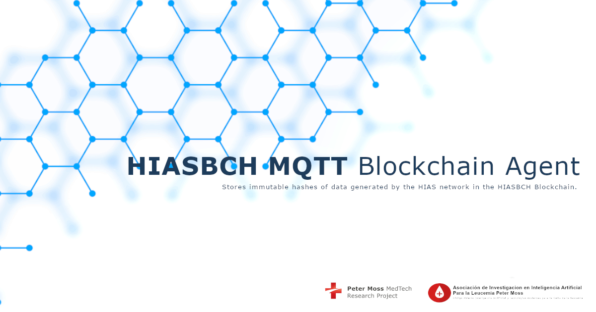

# Asociación de Investigacion en Inteligencia Artificial Para la Leucemia Peter Moss
## HIASBCH MQTT Blockchain Agent

    

   

&nbsp;

# Table Of Contents

- [Introduction](#introduction)
- [MQTT](#mqtt)
- [Blockhain](#blockhain)
- [HIAS](#hias)
  - [HIASBCH Smart Contracts](#hiasbch-smart-contracts)
  - [HIAS IoT Agents](#hias-iot-agents)
- [GETTING STARTED](#getting-started)
- [Contributing](#contributing)
  - [Contributors](#contributors)
- [Versioning](#versioning)
- [License](#license)
- [Bugs/Issues](#bugs-issues)

&nbsp;

# Introduction

A **HIASBCH Blockchain Agent** is a bridge between **HIAS IoT Agents**, and **HIASBCH Private Ethereum Blockhain**. The **HIASBCH MQTT Blockchain Agent** is a HIAS AI Agent that receives authenticated data and stores an immutable hash in the **HIASBCH iotJumpWay Smart Contract**.

The HIASBCH iotJumpWay Smart Contract stores permissions for all HIAS network devices and applications, and immutable hashes of data received from the HIAS network. These immutable hashes allow data integrity checks to be carried out on data stored in the historical database by comparing the hash of the data and the hash stored in HIASBCH.

&nbsp;

# MQTT

The Message Queuing Telemetry Transport (MQTT) is a lightweight machine to machine communication protocol designed to provide communication between low resource devices.

The protocol is publish-subscribe (Pub/Sub) communication protocol that runs over the Internet Protocol Suite (TCP/IP).

&nbsp;

# Blockchain

A blockchain is a immutable decentralized digital ledger of transactions stored in **blocks**. HIASBCH is a private [Ethereum](https://ethereum.org/en/) blockchain that hosts Smart Contracts that allow the HIAS network to function.

&nbsp;

# HIAS

[HIAS - Hospital Intelligent Automation Server](https://github.com/AIIAL/HIAS-Core) is an open-source automation server designed to control and manage an intelligent network of IoT connected devices and applications.

## HIASBCH Smart Contracts

The core Smart Contracts used on the HIAS network are:

- **HIAS Permissions Smart Contract** - Stores permissions for all HIAS devices, applications, agents and users.

- **HIAS iotJumpWay Smart Contract** - Stores iotJumpWay permissions for all HIAS devices, applications, agents and users. Stores immutable hashes of data received from the HIAS network.

## HIASBCH Blockchain Agents

The HIASBCH Blockchain Agents are a selection of protocol/transfer specific applications that act as a bridge between the **HIAS IoT Agents** and the **HIASBCH Private Ethereum Blockchain**.

&nbsp;

# GETTING STARTED

To get started follow the following guides:

- [Ubuntu intallation guide](docs/installation/ubuntu.md)
- [Ubuntu usage guide](docs/usage/ubuntu.md)

&nbsp;

# Contributing
Asociación de Investigacion en Inteligencia Artificial Para la Leucemia Peter Moss encourages and welcomes code contributions, bug fixes and enhancements from the Github community.

Please read the [CONTRIBUTING](CONTRIBUTING.md "CONTRIBUTING") document for a full guide to forking our repositories and submitting your pull requests. You will also find our code of conduct in the [Code of Conduct](CODE-OF-CONDUCT.md) document.

## Contributors
- [Adam Milton-Barker](https://www.leukemiaairesearch.com/association/volunteers/adam-milton-barker "Adam Milton-Barker") - [Asociación de Investigacion en Inteligencia Artificial Para la Leucemia Peter Moss](https://www.leukemiaresearchassociation.ai "Asociación de Investigacion en Inteligencia Artificial Para la Leucemia Peter Moss") President/Founder & Lead Developer, Sabadell, Spain

&nbsp;

# Versioning
We use SemVer for versioning.

&nbsp;

# License
This project is licensed under the **MIT License** - see the [LICENSE](LICENSE "LICENSE") file for details.

&nbsp;

# Bugs/Issues
We use the [repo issues](issues "repo issues") to track bugs and general requests related to using this project. See [CONTRIBUTING](CONTRIBUTING.md "CONTRIBUTING") for more info on how to submit bugs, feature requests and proposals.