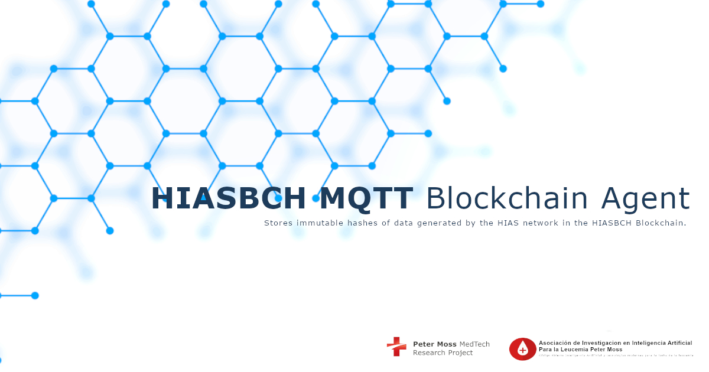

# Installation Guide (Ubuntu)



# Introduction
This guide will take you through the installation process for the **HIASBCH MQTT Blockchain Agent**.

&nbsp;

# Prerequisites
You will need to ensure you have the following prerequisites installed and setup.

## HIAS Core

The HIASBCH MQTT Blockchain Agent is a component of the [HIAS - Hospital Intelligent Automation Server](https://github.com/aiial/hias-core). Before beginning this tutorial you should complete the HIAS installation guide ensure your HIAS server is online.

&nbsp;

# Installation
You are now ready to install the HIASBCH MQTT Blockchain Agent software.

## Clone the repository

Clone the [HIASBCH MQTT Blockchain Agent](https://github.com/aiial/hiasbch-mqtt-blockchain-agent " HIASBCH MQTT Blockchain Agent") repository from the [Asociación de Investigacion en Inteligencia Artificial Para la Leucemia Peter Moss](https://github.com/aiial "Asociación de Investigacion en Inteligencia Artificial Para la Leucemia Peter Moss") Github Organization to your HIAS project root.

To clone the repository and install the project, make sure you have Git installed. Now navigate to your HIAS Core project root and then use the following command.

``` bash
 git clone https://github.com/aiial/hiasbch-mqtt-blockchain-agent.git
 mv hiasbch-mqtt-blockchain-agent components/agents/hiasbch
```

This will clone the HIASBCH MQTT Blockchain Agent repository and move the cloned repository to the agents directory in the HIAS Core project (components/agents/hiasbch/).

``` bash
 cd components/agents/
 ls
```

Using the ls command in your home directory should show you the following.

``` bash
 hiasbch
```

## Installation script

All other software requirements are included in **scripts/install.sh**. You can run this file on your machine from the HIAS project root in terminal. Use the following command from the HIAS project root:

``` bash
 sh components/agents/mqtt/scripts/install.sh
```

&nbsp;

# HIAS Setup

This device is a **HIAS IoT Agent** and uses the **HIAS iotJumpWay MQTT Broker** to communicate with the HIAS network. To set up an IoT Agent on the HIAS network, head to your **HIAS Server UI**.

The HIAS network is powered by a context broker that stores contextual data and exposes the data securely to authenticated HIAS applications and devices. Each HIAS IoT Agent has a JSON representation stored in the HIASCDI Context Broker that holds their contextual information.

## HIAS IoT Agent

A HIAS IoT Agent is a bridge between HIAS devices and applications, and the **HIASCDI Context Broker** & **HIAS Historical Broker**. The IoT Agents process incoming data using a specific machine to machine communication protocol and then converting into a format compatible with HIASCDI, before sending the data to HIASCDI to update the contextual information.


You will now need to create your HIAS IoT Agent and retrieve the agent credentials. Navigate to **IoT->Entities->Agents** and click on **+ Create Agent** to create a HIAS IoT Agent.


Make sure to select **MQTT** as the protocol for your Agent. Once you have completed the form and submitted it, you can find the newly created AI Agent by navigating to **IoT->Entities->Agents** and clicking on the relevant Agent.

On the HIAS IoT Agent page you will be able to update the contextual data for the agent, and also find the JSON representation.


You now need to download the credentials required to connect the agent to the HIAS network.

Click on the **Agent Credentials** section to download the credentials file. This should open your file browser, navigate to the **HIAS-Core/components/agents/hiasbch/configuration/** directory and save the file as **credentials.json**.

The final configuration you have to do is in the **configuration/config.json** file.

``` json
{
    "agent": {
        "params": [],
        "api": {
            "content": "application/json"
        },
        "proxy": {
            "up": ""
        }
    }
}
```

You need to add the following:

- **agent->proxy:** IoT Agent API Key

&nbsp;

# Services
You will now create the services that will run your Blockchain Agent. Making sure you are in the HIAS Core project root, use the following command:

``` bash
sh components/agents/hiasbch/scripts/service.sh
```

&nbsp;

# Continue
Now you can continue with the HIAS [usage guide](../usage/ubuntu.md)

&nbsp;

# Contributing
Asociación de Investigacion en Inteligencia Artificial Para la Leucemia Peter Moss encourages and welcomes code contributions, bug fixes and enhancements from the Github community.

Please read the [CONTRIBUTING](https://github.com/aiial/hiasbch-mqtt-blockchain-agent/blob/main/CONTRIBUTING.md "CONTRIBUTING") document for a full guide to forking our repositories and submitting your pull requests. You will also find our code of conduct in the [Code of Conduct](https://github.com/aiial/hiasbch-mqtt-blockchain-agent/blob/main/CODE-OF-CONDUCT.md) document.

## Contributors
- [Adam Milton-Barker](https://www.leukemiaairesearch.com/association/volunteers/adam-milton-barker "Adam Milton-Barker") - [Asociación de Investigacion en Inteligencia Artificial Para la Leucemia Peter Moss](https://www.leukemiaresearchassociation.ai "Asociación de Investigacion en Inteligencia Artificial Para la Leucemia Peter Moss") President/Founder & Lead Developer, Sabadell, Spain

&nbsp;

# Versioning
We use SemVer for versioning.

&nbsp;

# License
This project is licensed under the **MIT License** - see the [LICENSE](https://github.com/aiial/hiasbch-mqtt-blockchain-agent/blob/main/LICENSE "LICENSE") file for details.

&nbsp;

# Bugs/Issues
We use the [repo issues](https://github.com/aiial/hiasbch-mqtt-blockchain-agent/issues "repo issues") to track bugs and general requests related to using this project. See [CONTRIBUTING](https://github.com/aiial/hiasbch-mqtt-blockchain-agent/CONTRIBUTING.md "CONTRIBUTING") for more info on how to submit bugs, feature requests and proposals.